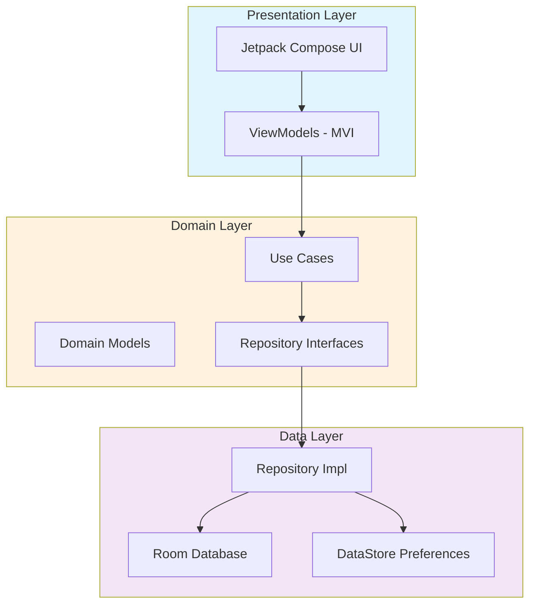
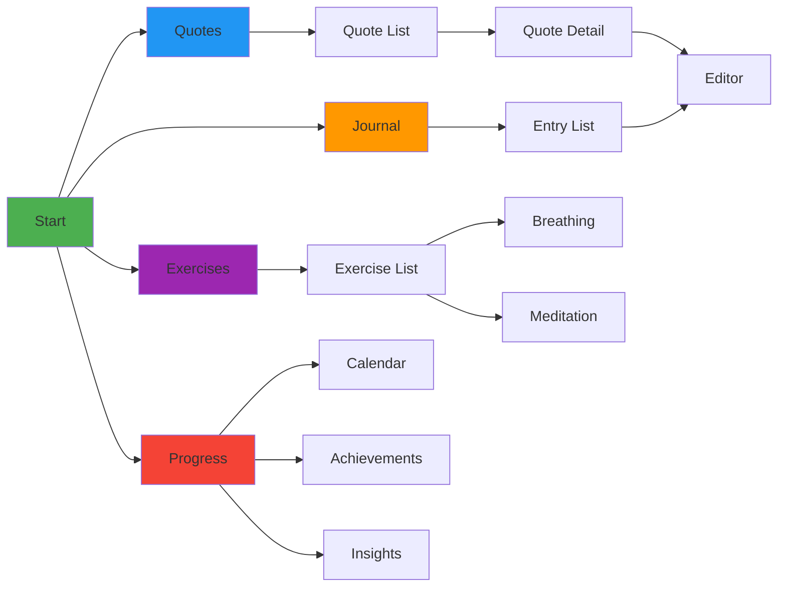
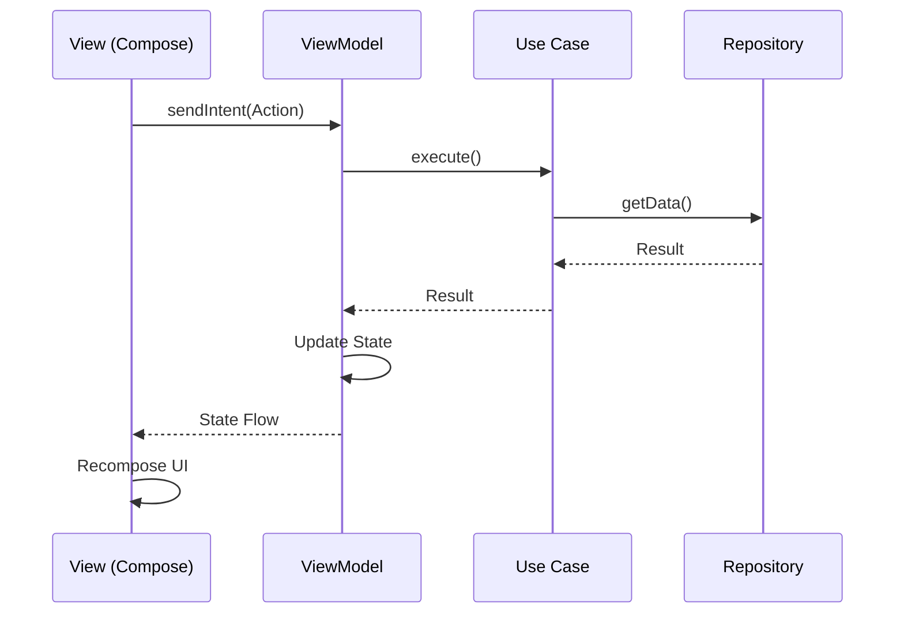

# Heauton Android

A wellness and mindfulness companion app that helps users build positive habits through daily reflective practices, guided exercises, and progress tracking.

## Features

- **Journaling** - Daily reflection with mood tracking and full-text search
- **Quotes** - Curated inspirational quotes with scheduled delivery
- **Exercises** - Guided breathing, meditation, visualization, and body scan
- **Progress** - Track streaks, achievements, and receive personalized insights
- **Notifications** - Smart scheduling for daily reminders and quote delivery

## Architecture



## App Flow



## MVI Pattern



## Design System

Heauton Android uses the **Light Steel** monochrome color palette - a sophisticated 9-shade grayscale system designed to reduce visual distractions and promote mental clarity.

### Color Palette

```
Light Shades (Backgrounds & Surfaces)
F8F9FA  Bright Snow      - Primary backgrounds
E9ECEF  Platinum         - Cards, elevated surfaces
DEE2E6  Alabaster Grey   - Borders, dividers
CED4DA  Pale Slate       - Secondary borders
ADB5BD  Pale Slate 2     - Subtle elements

Dark Shades (Text & Interactive)
6C757D  Slate Grey       - Secondary text
495057  Iron Grey        - Primary actions, brand color
343A40  Gunmetal         - Headings, emphasis
212529  Shadow Grey      - Primary text, maximum contrast
```

### Design Philosophy

- **Monochrome aesthetics** - Calm, focused environment for mindfulness
- **WCAG AAA compliant** - Exceptional contrast ratios (up to 21:1)
- **Material 3 integration** - Semantic color tokens for consistency
- **Accessibility first** - Color-blind friendly, high readability

### Implementation

Colors are accessed through Material 3's semantic tokens:

```kotlin
// Primary actions
MaterialTheme.colorScheme.primary           // Iron Grey
MaterialTheme.colorScheme.onPrimary         // Bright Snow

// Backgrounds
MaterialTheme.colorScheme.background        // Bright Snow
MaterialTheme.colorScheme.surface           // Bright Snow
MaterialTheme.colorScheme.surfaceVariant    // Platinum

// Text
MaterialTheme.colorScheme.onSurface         // Shadow Grey
MaterialTheme.colorScheme.onSurfaceVariant  // Iron Grey
```

For complete color usage guidelines, semantic mappings, and accessibility standards, see [COLOR_GUIDE.md](COLOR_GUIDE.md).

## Tech Stack

| Layer | Technology |
|-------|-----------|
| **UI** | Jetpack Compose, Material 3 |
| **Design** | Light Steel Monochrome Palette |
| **Architecture** | Clean Architecture, MVI |
| **DI** | Hilt |
| **Database** | Room (SQLite) |
| **Preferences** | DataStore |
| **Navigation** | Compose Navigation |
| **Async** | Kotlin Coroutines + Flow |
| **Widgets** | Jetpack Glance |

## Quick Start

```bash
# Build debug
./gradlew assembleDebug

# Run tests
./gradlew test

# Install on device
./gradlew installDebug
```

## Requirements

- **Min SDK**: 24 (Android 7.0)
- **Target SDK**: 35 (Android 15)
- **Kotlin**: 1.9+
- **Java**: 17

## Project Structure

```
app/src/main/java/com/po4yka/heauton/
├── di/              # Hilt dependency injection
├── domain/          # Business logic & use cases
│   ├── model/       # Domain models
│   ├── repository/  # Repository interfaces
│   └── usecase/     # Use cases
├── data/            # Data layer implementation
│   ├── local/       # Room database & DataStore
│   └── repository/  # Repository implementations
└── presentation/    # UI layer
    ├── navigation/  # Navigation setup
    ├── screens/     # Feature screens
    ├── components/  # Reusable components
    └── theme/       # Material 3 theming
```

## Core Features Breakdown

<details>
<summary><b>Exercises</b></summary>

- **Breathing**: Box breathing, 4-7-8, deep breathing, energizing
- **Meditation**: Guided sessions with timer
- **Visualization**: Mental imagery exercises
- **Body Scan**: Progressive relaxation
- Difficulty levels: Beginner → Intermediate → Advanced
- Before/after mood tracking
</details>

<details>
<summary><b>Progress Tracking</b></summary>

- Daily snapshots with activity scoring
- Calendar heatmap visualization
- Streak tracking (current & longest)
- Achievement system (Bronze/Silver/Gold tiers)
- AI-generated insights and recommendations
</details>

<details>
<summary><b>Journal</b></summary>

- Rich text entries with mood tracking
- Full-text search across all entries
- Tags and organization
- Quote integration
- Optional encryption for privacy
</details>

## Development Status

All planned features are implemented:
- Core infrastructure with MVI architecture
- Journaling system with encryption
- Wellness exercises (breathing, meditation, visualization, body scan)
- Progress tracking with achievements and insights
- Daily scheduling and notifications
- Home screen widgets
- Quote sharing and data export/import

## Contributing

This project uses:
- Kotlin 2.2.21
- Jetpack Compose with Material 3
- MVI architecture pattern
- Hilt for dependency injection
- Room for local storage
- WorkManager for scheduling

## License

See [LICENSE](LICENSE) file for details.
